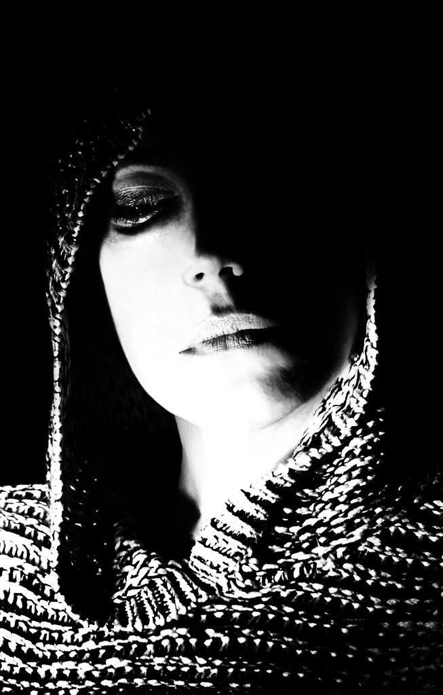

# convert_image_to_ascii.py

A image to ascii converter

\
[Original Image](https://www.flickr.com/photos/137731904@N05/32359806555)

```


                                      ..^
                       .        ...  .'.
                                  '`"""
                    '.. . .         ^^`
                    ."' ..        'I,.
                . '^ ".  .    .`;"
               .` ^^. .     .`,<:l!~~<ilI:^`'...
                .   . .  '':l. +xr\{->!!il;;;;,^'.
                 .  ^'. ';>'  l\ft|1[->l:"^^"::II,'
              ..'l` '. !~'    ;{\rjft{~>;,":"^^;!i;`.
               . ',.^ :+^      ">!~?!Il>!!I:`...`!<l'
             . ` ^I"`~]         . .```  `""    .^i[-"
               "''!,.|i      'II<<>i:+/}>`''^;i~_1/[;.
               '^ "It)'      ;[++_-<":l!+|rrnUQLJUc\<`
               "?; :t`      !/YXnt|\xCwa&88#**oakpZJ/"
            .`"`|{i]]'     -0pbh#&8B@$$@@%8&WMMM#*hdC;
             "_ :-[L_.    ^Q8&W&&%BBBB%%%8%8&&W&&WM#q\]_il,.
             .t]'`)f.     :b%%%%%BBBB%%%%888&&&&&&8&&WW*pQc[;!+-I.                                  .
            "^_v_+Xi       Y@%BB%%%%%%%%%%%888%%%&&8MQch#bw}'`"xn>                                 '''
             -l-]\)        loBBBBBBBBBBBBBB%%%BBBWW&dxz*&&#J]` .`.                                 ^ll
            ^}-'1z^         fB%BBBBBBBBBBBBBBBB@BB88&W#o##a*p}.                                    '|?
            !+[_t<          "pBBBBBBBBBBBBBBBBBBBBBBBB%WkZQ0wC{^                             ...   <O[
            .~'(n,           -WB%BBBBB@@@@@BBBBBBBBBBBBB#j+?{?->`..                         ..'`.  )*)
             _]f?`            n%%%BBB@B@@@@@@@@@@@@BBBBB8dJvzJQOCXxjt?!"'.                  .'^"`  ipf
             +cd-`'           ^O%%%B@@@@@@B@@@@@@@@@BBB%%%@@B%#bppZJYu\-l"'                 .`":^  u&U
             .-C_,"            >a%%B@@@@@@@@@@@@@@@$@B%8Waw0vzYf<I!:'..                    .'^;;' 'fB*!
             .fY:^:             [W%B@@@$$$@@@@@@@@8**&aOCr\t1jOCvr|-i;:Il:`                .^;<:  ]COdI
              )z.^`              (8BB@$$$$@@@@$$&bCuYb*M&W*#hkW&&MabbmLUcnt[!"'            ."~~"";cLWd!
              ic;.`.         ...  )&B@$$$$@@$$$@@BB@@BB@@$$$@@@@$$$@B%Mad0JYx}i"...        `l|)ivYv|Wh"
              )#<''             .. [*$@@$$$@$$$$@@$$$$$$$$$$@@@@@@B%%8WamXj1+!:`         .:-vakdpOwQ*1.
              }U^...           ...  l0$$$$$$$$$$$$$$$$$$$$$$$@@@BB%8WhmLv|[~;'  ..     .,?f/Yd0dvt&@O:
              iC< ".        .  ..  . ')h$$$$$$$$$$$$$@$$$$$$$@@@BB@B%&h0ct)-!I:^`.   ."?xu(!faqpn{wM[
              -b1``           . . ..'' ^)m%$$$$$$$$$$$$$$$$$$$$$$$$$$@%MdOYu/{[]>,`:~(ccYXLa8QOddCQ{
             `na-'            .  .. ...  .<rp%$$$$$$$$$$$$$$$$$$$@@@$$$@8#akwQUvrrvJmbq+JM*mf|fhkWU"  '`
             lOo>.                 .....    .!(ZW%@$$$$$$$$$$$$$$$$@@$$@B&#apZmqkaoo#*qJJj&pvf{1mu>   ,:
             ;Y&1  .                        .  ;Cph#8B@$$$$$$$$$$$$@BB%8W*ah*W%%%88B@$%Y['|o*O&pj. <r,.,
             >Y#/. .                    .       )pba#&%@@$$$$$$$$$@BBB%%BBBB@@@@@Ba&#C\\crl;w*Z^<f:<}:I~.
            'xO%f.                              ^Yk#&8%@$$$$$$$$$$$@@@@@@@@@@$$$&Ouv~ .wnCaw}:?0dpzj~?!.
            :kMB\ '.                             [pM8%B@$$$$$$$$$$@@@@@@@@$$$%d00O{_LJt0Zzl!{Crtwu'Ii  "
            +fM8[ ..   .                         _C*&BB@@$$$$$$$$$$$$$$@$$@&hLw0hBB*/(|:' i}\ur/Jn|n+';,
            lrBB1 . .'..                         ]XbW%B@@$$$$$$$$$$$$$$$$&*W8MUJwLUt` .~||1uLQJjnn<!i.^               .
            [a8@j . ``   `'                     `]zwo8B@$$$$$$$$$$$$$@B%apb*da|;'.   '.:1|trOC!nC]"<[^             . `^.
?tr_|c/(1zYcJc%$d``+,.'. ..                     "-uwd#%@$$$$$$$$@M8&%$BW_;_})|f!. :!^"]\uCurmdbZ\\["`  .". .;    .^. ^'
aof\rjv_)qZ~nZ%MY.'"' ^^                        .^<fCp&$$$$$$$$$@ou(CJbkbO|;    ><-f(\1cwQLZL0!,]_ 'l.^^'  ,"   "^    '
MvJhZcOpLZzc|X&kc^`. `'   .                        .IrM$$$$$BCXh$$$du)-I!1?^':^ '!_;}_/)x)^}0fI]1|l `"!".^',.   ~,l[-_fu
0OcLJLc|;YLmuWB@o,:' ..   `                          "m$$@$@Bkfj(~tQhObx"   "j).?nz|nfJLWdnvX|jXj[_:"<ri;<;,":.   ;";-[_
omXqd0QOQ0)}]0&Bz^, ,l'  ,.   .^.                   .?hB%{\hhM$%hn?;'I__^ '^,; ^l"1cQr}/x)uvz?~;]>)/`"n):l))i<_,.!:  '^.
dv\j}:lQX)Lkmdkoi . `,.  '    .^`                  `{p&%@duY//zmbd&onl:. ._YX[)0Y+[]livj::|Xn]"_UO\!^~-^ _r!(]>+_cz<,:++
%%$%WbQXt"tr"rpa:^;         `  ~?l-]<'             .)#Yf#BQWhL0r1;!___I. '...l+<!tC\:^/r,;1|rznYQ(;-rOn'     '  ,{!"[r?i
OCOmZ8dZ#L)rrxBL^ .'..      `  )+?]f\}-" `         ^QB*0OZJz00*%0Y)/"   ^+x\-u)";<\i>nbLjx{cO("' \cf1Xx"[('l],     ,.
hbXLJXQ_JOQ8$M@J  .^.  ..".   .;_?I;Qda}:t-` .:` ';jaLYa%8%hLvY1))/zx!    `<?|\XJbvf/rOJ)c</(i> .`',^.,/]+1()[?~`^l]-l.;
Z&WmkYpkCn{zY}q-   ".    `:,  "_;~xzzCu)XMm)![\{-^IxQqOLqxXCdYWbU)CQkn"\r/}1-^:(p|>I1?ZCpWt"!vJ[l)>';` `  ^I  <!  i),`.+
v&\_dX1c){x1n0#f          l:   ^I>J#00hvxJfnn~luZ]I"lfmUmoqwk}tza}-?`fJ{,")m\? )w`~[I"""[u/>(c+~u<^:cc"<~>.  "  `".
$$qQoU>..1~\pM@p.              ":-mYpXrUI`zb]j<.j%0{}i>]t0CU%c|fCC|tI:[101nf~:I<^{u]?f|! ,;''^  >" _),`]~>!]-`  !+^ .il.
8)J&JmqqY?!'Yt]q1^            :\uj)zU|LUC~+jQJf] _pk\]Jn,,}lnCfppJj/cfjYn-]1Cv]l{|?+tUuI:nJ-+tuI'-" ^`     `,. .:I   '`l
_ r)}b^XbbwJc|xh%Ql.          !c)>rxr!1q\v?,}huYJI:tm~fc+li~[1~](}[?i_{/i:' ;l':"   ,>:.{~'^]j+~11:'i/[`'~?: `<-_^ "^  .
r]->>]"i)|pY\&wjbmax!^         ^ 'Zxn; \o\-l`[Bb0h11<.^]\]QqtlizC|-_1Y/!I1{^lrr! >^  '..'   '' "?' ;{;l`:}:   `'     ",
v1OWnJJt_[?__t?<f|]|Ux[{^l, '^:\, -0[OI'0YJa)/r|"..l` _1  i?` `[-  .i<' l1` ,1"']]<,!-I.,:"   ^` ..     "^ .:::. ^'^:,'
j(-(^?v<XJ{Q0cJXfcz?'th*JC{?L?\bv{XQ{q\_cJ~)t({{(r}    "\(:`." :l^}+ .<" .   .  :, "], `+;' l{!,'     .";' .li;'."^I>;'.
8Qkhpv1<l^;x)i[|"m#1jd\<r[`;t(n-<>}Yxt{~?c|c0c/YLn_))" lJJ)/Qc` <n|!!((^"_l``<<` `.         ';        `;    "'   '.
1 |Wt1dbvvQYzvrY0Jccf{vqhU)Cf]{Cv+;{vII[Qt'^fn "j_ lf' +t` '/}. "<" .1: ~\'.+>,';i`'^^        `:`   .^.  ..'   '..''...`
Lv|/-^l" ]n|n/^zci_C{`If; :f::+]l,`_I">jr\__<!,<!]~^.+<`.`^,   ..               i! .!l   ,?.  !;.  `;^`  ."'   '..'.  ..
cMqXkp{fu(>}(1cJrCmO)/QQf!11(wb*CCQ_"?}[itaU{?n{ivOj!JOr>iu\"`__.:>``,: '^.       .           .    .,    ."  .. ..`.'`''
}-~<xl^\|'rW(}Wt:rUlld*)_nY<"_);`l\i'`t\  !!'!_^ >-. {t~!/1  :). l; '!^ il  :?` `_".  .     .'     .    .'  .^' .'' ..
[_\r_+j{I}~II|{}uv)Il_[j\~,~vc->{/i')LfI{v}ii:,)/['!+"<))l    ;_: "I        .^   ".   `    ;^    '..    '   .`     ..
lf1""~~!1U-`_/-~Cf]Op}!l}};I-l:^>"  ':`.^,"`'",l""',I`^!!".`  I<" ::  .                          .                .'.
```

Using a custom characters (-c/--chars '▀▁▂▃▄▅▆▇█▉▊▋▌▍▎▏▐▒▓▔▕▖▗▘▙▚▛▜▝▞▟ ')

```


                                        ▁

                                   ▕▁▁▁
                                    ▁▕▕
                     ▁▕           ▕▏▁
                   ▁ ▁         ▕▔▁
                ▕ ▕▕         ▕▔▗▔▏▂▖▖▗▂▏▏▔▁▕
                          ▕▔▏  ▖▒▒▍▃▎▗▂▂▂▏▏▏▏▔▁▕▕
                    ▁▕  ▕▔▗▕  ▏▍▄▐▍▘▝▎▗▏▔▁▁▁▁▔▔▏▏▁▕
                ▕▏▕ ▕  ▂▖▕    ▏▃▍▄▄▄▐▃▖▂▔▁▁▔▁▕▁▔▏▂▔▕
                  ▁ ▁ ▔▖▁      ▁▂▂▗▎▂▏▏▗▂▂▏▔▕   ▕▂▗▏▕
               ▕ ▁▏▁▕▖▝            ▕▕▕  ▕▁▁     ▁▂▝▎▁
               ▁▕▕▏▁ ▍▂       ▏▏▗▗▗▂▔▖▐▝▗▕▕▕▕▔▂▖▖▘▐▝▔
               ▕▁ ▁▏▐▘▕      ▏▝▖▖▖▎▗▁▔▏▂▖▍▄▒▞▅▋▀▅▅▚▍▗▕
               ▁▎▔ ▔▐▕      ▏▐▌▌▒▐▍▍▒▀▟▓▊▇▇▛▛▛▓▓▜▟▆▅▐▁
             ▕▁▕▍▃▂▝▝▕     ▎▋▟▙▜▛▊▇▉▉██▉▉▉▇▊▊▊▊▊▛▛▜▙▅▔
             ▁▖ ▔▎▝▀▎     ▕▋▇▊▊▇▇▇▉▉▉▉▉▉▇▇▇▇▇▊▊▊▊▊▛▛▟▐▝▖▂▏▔
              ▐▝▕▕▘▄      ▔▜▉▇▇▉▉▉▉▉▉▉▉▇▇▇▇▇▇▇▇▇▇▇▇▇▊▊▊▛▙▀▚▝▔▂▖▎▏
            ▁▁▖▞▖▖▚▂       ▌▉▉▉▉▉▇▉▉▉▉▇▉▉▉▇▇▇▇▇▇▇▇▇▇▊▋▚▓▛▜▆▃▕▕▁▒▞▗                                  ▕▕
             ▎▏▎▝▍▘        ▏▓▉▉▉▉▉▉▉▉▉▉▉▉▉▉▉▇▉▉▉▉▊▊▇▙▒▚▛▇▊▛▅▝▕  ▕                                  ▕▏▏
            ▕▝▎▕▃▚▕         ▄▉▉▉▉▉▉▉▉▉▉▉▉▉▉▉▉▉▉▉▉▉▇▇▊▊▛▓▛▛▓▓▟▃                                     ▕▍▎
            ▏▖▝▖▐▗          ▁▟▉▉▉▉▉▉▉▉▉▉▉▉▉▉▉▉▉▉▉▉▉▉▉▉▇▊▜▆▀▋▟▀▃▕                                   ▗▋▝
             ▗ ▘▒▁           ▎▊▉▉▉▉▉▉▉▉▉▉▉▉▉▉▉▉▉▉▉▉▉▉▉▉▉▛▄▖▎▃▎▎▂▕                             ▕▕   ▘▓▘
             ▖▎▄▎▕            ▞▇▇▉▉▉▉▉▉▉▉▉▉▉▉▉▉▉▉▉▉▉▉▉▉▉▇▙▅▞▚▅▀▋▅▌▒▄▐▎▏▁▕                    ▕▕▁▕  ▂▙▄
             ▖▚▙▎▕▕           ▁▋▉▇▉▉▉▉▉▉▉▉▉▉▉▉▉▉▉▉▉▉▉▉▉▉▇▇▉▉▉▇▛▜▟▙▆▅▌▞▍▎▏▁                   ▕▁▔▁  ▞▊▅
              ▎▀▎▁▁            ▗▓▉▇▉▉▉▉▉▉▉▉▉▉▉▉▉▉▉▉█▉▉▉▇▊▓▟▋▞▚▌▄▗▏▏▔▕                       ▕▁▏▏▕ ▕▄▉▛▂
              ▐▌▔▕▔             ▝▊▇▉▉▉▉███▉▉▉▉▉▉▉▉▇▓▛▊▓▆▀▄▍▐▘▄▋▀▞▄▍▎▂▔▔▏▏▔▕                 ▕▔▗▔  ▝▅▋▙▏
              ▘▚ ▕▕              ▘▇▉▉▉████▉▉▉▉██▇▙▅▞▌▙▛▊▊▊▛▛▓▜▊▇▇▊▓▙▙▆▀▌▚▞▐▝▂▁              ▁▗▖▁▁▏▚▀▊▙▂
              ▂▚▏ ▕               ▘▇▉▉████▉▉███▉▉▉▉▉▉▉▉▉▉███▉▉▉▉███▉▉▇▊▓▙▋▅▌▒▃▂▁           ▕▏▍▘▂▚▌▞▍▊▜▁
              ▘▛▗ ▕                ▝▛█▉▉███▉████▉▉██████████▉▉▉▉▉▉▉▉▇▇▊▓▆▌▄▘▖▂▔▕          ▔▎▚▓▜▙▟▋▟▀▛▃
              ▝▅▕                   ▏▋███████████████████████▉▉▉▉▉▉▇▊▜▆▀▞▍▝▗▔▕          ▁▎▄▐▌▙▋▙▚▐▊▉▋▔
              ▂▅▗ ▁                   ▘▜█████████████▉███████▉▉▉▉▉▉▉▉▊▜▋▚▐▘▎▂▏▔▕▕     ▁▎▒▞▍▂▄▓▟▟▒▃▆▊▝
              ▎▜▃▕▕                 ▕▕ ▕▘▆▉██████████████████████████▉▉▊▙▋▌▞▐▃▝▝▂▔▕▔▗▘▚▚▌▌▀▓▇▀▆▙▙▀▋▃
             ▕▞▓▎                         ▗▒▙▇███████████████████▉▉▉███▉▇▛▓▜▟▀▌▞▄▒▞▅▆▙▟▖▅▊▓▆▄▍▄▜▜▊▌▁  ▕▕
             ▏▆▓▗                            ▂▘▆▊▇▉████████████████▉▉██▉▉▊▛▓▟▆▆▟▜▓▓▓▛▛▟▅▅▄▊▙▚▄▃▃▆▞▗   ▔▔
             ▔▌▇▘                              ▔▅▙▓▛▇▉▉████████████▉▉▉▉▇▊▛▓▓▓▊▇▇▇▇▇▉▉█▇▌▝▕▍▓▓▋▊▟▄  ▗▒▁ ▁
             ▂▌▛▐                               ▘▟▜▓▛▊▇▉▉█████████▉▉▉▉▇▉▉▉▉▉▉▉▉▉▉▉▓▊▛▅▍▍▚▄▏▏▟▓▆▕▗▄▔▗▃▔▏▗
            ▕▒▋▇▄                               ▕▌▜▛▊▇▇▉███████████▉▉▉▉▉▉▉▉▉▉███▊▋▞▞▗  ▟▞▅▓▆▃▔▎▋▙▟▚▄▖▎▂
            ▔▜▊▉▍ ▕                              ▝▙▛▇▇▉▉██████████▉▉▉▉▉▉▉▉███▉▙▋▋▋▃▖▀▅▐▋▆▚▏▂▃▀▒▐▆▞ ▏▂  ▁
            ▖▐▛▇▝                                ▖▅▓▇▉▉▉▉██████████████▉██▉▇▜▀▆▋▜▉▉▛▐▘▍▔  ▂▝▍▞▄▐▅▒▍▒▖▕▔▁
            ▏▒▉▉▘                                ▎▚▙▊▇▉▉▉████████████████▇▛▊▇▊▌▅▟▀▌▐▕  ▗▍▍▘▞▀▀▅▄▞▞▗▂▂ ▁
            ▝▓▇▉▄   ▕▕   ▕▕                     ▕▝▚▟▓▇▉▉█████████████▉▉▇▓▙▙▛▙▓▍▔     ▕ ▔▃▍▐▄▋▀▂▞▅▎▁▗▝▁               ▕▁
▎▐▄▖▍▚▐▍▃▚▌▚▅▚▇█▙▕▕▖▁                           ▁▎▞▟▙▛▇▉████████▉▊▇▇▇█▉▊▎▔▖▃▘▍▐▏  ▔▂▁▁▎▐▞▅▞▒▆▙▙▆▐▍▝▁▕   ▁   ▏     ▕  ▁
▓▓▄▍▒▄▞▖▘▟▆▖▞▆▇▊▌  ▁▕ ▁▕                         ▕▗▄▅▟▇█████████▉▓▞▍▅▅▙▜▜▋▍▔    ▗▗▎▄▘▍▘▚▆▋▀▆▀▋▂▁▎▖ ▕▏ ▕▕   ▁▁   ▁▁
▊▚▅▜▆▚▋▟▀▆▚▚▍▌▇▜▚▕▕  ▕▕                             ▏▄▊█████▉▀▌▜███▙▞▘▎▏▂▘▎▕ ▔▕ ▕▏▖▔▃▎▐▘▒▘▁▃▋▄▏▝▃▍▏ ▕▁▂▁ ▕ ▁    ▗▔▏▝▎▎▐▞
▋▋▚▀▅▀▚▍▔▌▀▆▞▊▉▉▓▁▔▕      ▕                          ▁▆██▉█▉▉▜▄▄▘▖▐▀▜▋▙▒▁   ▁▄▘ ▎▒▚▍▒▄▅▀▊▙▒▞▌▍▄▌▄▝▖▔▁▗▄▂▔▗▏▁▁▔    ▔▁▔▎▝▖
▓▆▌▟▙▋▋▋▀▋▘▃▝▋▇▉▚▕▔ ▁▏   ▁     ▕                     ▎▓▉▇▃▐▜▜▊█▇▜▒▎▏ ▏▎▎▁ ▕▕▁▔ ▕▏▁▘▚▋▄▃▐▒▘▞▚▚▎▗▔▝▗▘▐▕▁▞▘▔▏▘▘▂▗▖▔ ▂▔  ▕▕
▙▞▍▄▃▔▏▀▌▘▀▜▆▙▜▓▂   ▕▁   ▕     ▕▕                  ▕▃▟▇▉▉▙▞▌▐▐▚▆▙▙▇▓▒▏▔   ▖▌▌▝▘▋▌▖▝▎▏▂▞▄▔▔▍▚▒▝▁▖▅▆▐▂▕▗▎▕ ▖▄▂▘▎▂▖▖▚▚▗▁▔▖▖
▇▇█▇▊▙▋▌▐▁▐▄▁▒▟▓▔▁▔         ▕  ▗▎▏▎▎▗▕              ▘▛▌▄▛▉▋▊▜▀▋▄▃▏▂▖▎▎▏      ▏▖▗▏▐▅▍▔▕▐▒▔▔▃▍▄▚▞▌▀▘▔▎▒▋▒▕     ▕  ▁▃▂▁▝▄▎▂
▋▀▆▆▆▇▙▆▛▀▘▒▄▒▉▀▁           ▕  ▘▖▎▎▄▐▝▎▁ ▕         ▁▀▉▛▋▆▆▅▚▋▋▓▇▋▌▘▐▁   ▕▖▒▐▎▞▘▁▔▗▍▂▂▞▙▀▄▒▃▚▋▘▁  ▍▚▄▃▌▒▁▝▘▕▏▎▁     ▁
▜▜▚▀▅▌▋▖▅▋▀▇█▛▉▅   ▕     ▁     ▔▖▎▏▏▋▙▓▃▔▐▎▕  ▔▕ ▕▔▄▓▀▌▓▇▇▇▜▀▚▌▘▘▘▐▚▒▂    ▕▗▎▍▍▌▅▙▞▐▐▒▆▅▘▚▗▐▘▂▂  ▕▕▁▁ ▁▐▝▖▘▍▘▝▎▗▕▕▏▝▎▏ ▔
▆▊▊▆▜▌▟▜▅▒▃▚▌▃▟▎   ▁     ▕▔▁  ▁▎▏▖▒▚▚▀▞▘▌▛▆▘▂▝▍▃▎▕▏▒▀▟▆▀▟▒▚▀▙▌▊▜▅▘▅▋▜▒▁▍▒▐▝▃▎▕▔▘▙▍▗▏▘▎▆▀▙▊▐▁▏▞▅▝▏▘▂▕▔▕ ▕  ▕▏  ▗▂  ▂▘▁▕ ▖
▞▊▍▎▙▌▘▚▘▃▒▘▒▋▛▐          ▏▔   ▁▏▂▅▛▋▋▜▞▒▅▄▒▞▗▏▞▆▝▏▁▏▄▆▌▆▓▟▟▜▝▐▚▓▝▎▎▕▄▅▃▔▁▘▆▍▎ ▘▆▕▗▝▏▁▁▁▝▞▐▗▘▚▖▖▞▗▁▔▚▚▁▗▗▂   ▁  ▕▁
██▟▀▓▅▂  ▃▗▍▙▊▉▟               ▁▔▎▆▌▙▚▒▌▏▕▚▙▝▄▗ ▄▇▋▃▝▂▂▝▐▋▅▌▇▚▍▄▅▀▍▐▏▔▝▘▋▃▒▄▖▔▏▗▕▃▞▝▎▄▍▂ ▁▔▕▕▕  ▗▁ ▖▘▔▕▝▗▂▂▎▎▕  ▏▖▕  ▂▏
▇▘▅▇▅▆▟▟▌▎▂▕▌▐▝▟▘▁            ▔▍▞▄▘▚▅▍▀▌▅▗▖▄▀▅▄▝ ▎▙▜▐▝▅▞▁▔▃▏▒▅▄▙▙▅▄▐▚▄▄▌▞▎▝▃▀▞▝▏▃▍▎▖▐▅▞▏▔▒▅▎▖▐▞▏▕▎▁ ▕▕     ▕▁   ▔▏    ▕▏
▖ ▒▘▃▙▁▌▙▙▆▅▚▍▒▜▇▀▏           ▂▚▘▗▄▒▒▂▃▟▍▞▎▔▃▜▞▌▅▏▔▐▆▗▄▚▖▏▂▖▝▃▗▎▘▃▝▎▂▖▃▐▂▔▕ ▔▏▕▔▁   ▁▗▔ ▃▗ ▁▝▄▖▖▘▃▔ ▂▐▝▕▕▗▎▔ ▕▗▎▎▕ ▁▕
▒▝▎▗▗▎▁▂▘▍▟▌▐▊▟▄▙▆▓▒▏▕         ▕ ▕▆▒▞▔ ▍▓▐▎▏▕▝▉▙▋▜▃▘▗ ▕▝▍▝▀▟▐▏▂▚▅▍▎▖▃▌▐▏▏▘▃▕▏▒▄▂ ▂▁  ▕  ▕   ▕▕ ▁▎  ▔▃▏▏▕▔▃▔   ▕      ▁▁
▞▘▋▊▞▅▅▐▖▝▎▖▖▐▎▗▐▍▝▍▅▒▝▃▕▏▔ ▕▕▔▍▔ ▎▋▝▆▏▕▋▌▅▓▘▐▒▍▁  ▏▕ ▎▘  ▂▎▕ ▕▝▎   ▂▗▕ ▏▃▕ ▁▘▁▕▝▎▗▁▂▎▏ ▔▔▁   ▁▕        ▁▕  ▔▔▔  ▕▕▕▔▔▕
▄▘▎▘▕▎▞▗▌▅▃▀▋▚▅▌▄▚▚▎▕▐▜▓▅▀▃▎▀▎▍▙▞▃▌▀▃▟▍▖▚▅▖▘▐▘▃▃▘▄▃    ▁▍▘▔▕ ▁ ▔▏▕▝▖  ▗▁        ▔▁ ▁▎▁ ▕▖▔▕ ▏▃▂▁       ▁▔▕  ▏▂▏▕ ▁▁▏▂▏▕
▇▋▜▜▟▞▘▗▏▕▔▒▘▂▝▍▁▆▛▘▄▙▍▗▄▝▕▔▐▘▞▎▗▗▃▌▒▐▃▖▎▚▍▚▋▚▐▌▀▒▖▘▘▁ ▏▅▅▘▐▀▚▕ ▗▒▍▏▂▘▍▁▁▖▏▕▕▗▗▕ ▕          ▕▔        ▕▔    ▁▕   ▕
▃ ▍▊▐▘▙▜▚▞▀▌▚▞▒▌▋▅▚▚▄▃▞▟▜▅▘▅▄▎▃▅▚▖▏▃▞▏▏▝▀▐ ▁▐▞ ▁▄▎ ▏▐▕ ▖▐▕ ▕▐▝  ▁▗▁  ▃▔ ▖▍▕ ▖▗▁▕▏▂▕ ▕▕        ▕▔▕    ▕     ▕   ▕  ▕▕   ▕
▀▚▍▐▎▁▏▁ ▝▒▍▞▐▁▚▚▂▖▅▃▕▏▄▔ ▔▄▔▔▖▎▏▔▕▖▏▁▗▄▒▍▖▖▗▂▔▗▂▝▖▁ ▖▗▕ ▕▁▁                    ▂▂  ▂▏   ▁▎   ▂▔   ▕▔▁▕   ▁▕   ▕  ▕
▚▊▟▌▜▟▃▐▞▍▗▃▘▃▚▅▒▅▆▆▘▐▀▀▄▏▘▘▘▟▙▛▀▀▋▖▁▎▃▝▂▐▓▅▃▎▒▃▂▞▆▄▂▅▆▄▂▂▞▍▁▕▖▖ ▔▂▕▕▔▔ ▕▁                          ▔     ▁       ▕ ▕▕▕▕
▃▎▗▗▒▏▁▍▍ ▒▊▘▃▊▐▔▒▌▏▏▙▛▘▖▒▌▗▁▎▘▔▕▏▐▂▕▕▐▐  ▂▂ ▏▖▁ ▂▎  ▃▐▖▏▐▘  ▔▘  ▏▔  ▂▁ ▂▏  ▔▎▕ ▕▖▁          ▕           ▕   ▁▕  ▕▕
▝▖▍▄▖▖▄▃▏▃▗▏▏▍▃▝▞▞▘▏▏▎▝▄▍▗▔▖▞▚▎▗▃▐▂▕▘▀▄▏▃▞▃▂▂▔▔▘▐▝▕▏▖▁▗▘▘▏    ▏▖▔ ▁▏         ▕   ▁    ▕    ▏▕    ▕      ▕    ▕
▏▄▘▁▁▗▗▂▃▌▎▕▖▐▎▗▀▄▝▋▙▃▂▏▃▝▏▏▎▏▔▕▗▁   ▔▕ ▕▔▁▕ ▁▁▏▁▁▕▁▏▕▁▂▂▁ ▕  ▏▗▁ ▔▔                                               ▕
```
## What?

Convert an image to ascii

```bash
usage: convert_image_to_ascii.py [-h] -i IMAGE_FILE [-o OUT_FILE] [-s SHADER] [-c CHARACTERS] [-f FONT] [-x CUSTOM_WIDTH] [-y CUSTOM_HEIGHT] [-a ASPECT] [-b]

Convert image to ascii

optional arguments:
    -h, --help
            show this help message and exit
    -i IMAGE_FILE, --image IMAGE_FILE
            Image file to use
            Default: None
    -o OUT_FILE, --out-file OUT_FILE
            Text file to write
            Default: None
    -s SHADER, --shader SHADER
            Dark to light characters to use
            Default:  .'`^",:;Il!i><~+_-?][}{1)(|\/tfjrxnuvczXYUJCLQ0OZmwqpdbkhao*#MW&8%B@$
    -c CHARACTERS, --chars CHARACTERS
            Dark to light characters to use
            Overrides -s/--shader
    -f FONT, --font FONT
            Font used to determine brightness when specifing characters
            Required for non-macOS systems
    -x CUSTOM_WIDTH, --width CUSTOM_WIDTH
            Custom width, recommended only for file output
            Default: Window width
    -y CUSTOM_HEIGHT, --height CUSTOM_HEIGHT
            Custom height, recommended only for file output
            Default: Window height
    -a ASPECT, --char-aspect ASPECT
            Aspect ratio of the character, ADVANCED
            Default: 2.4Adjust if aspect ration of the image feels off.  Height / width of a character block
    -b, --black-on-white
            Terminal is using dark text on light background
            Default: False
```

## Why?
In trying to find converts, I was surprised to see that there were not that many and of those, little options and choices.  In particular, the characters I wanted to use.  See hangman art that I crated manually instead.

## Improvements?
So much could be done.  Colour? Thought about it.  Better shape/character selection. As in, double the scale of the image and break the characters in to quadrants and measure each.  So images that have a darker upperleft and lower right would be assigned a \ and upper left and lower left would be [, etc

## State?
No known bugs.  Works.
